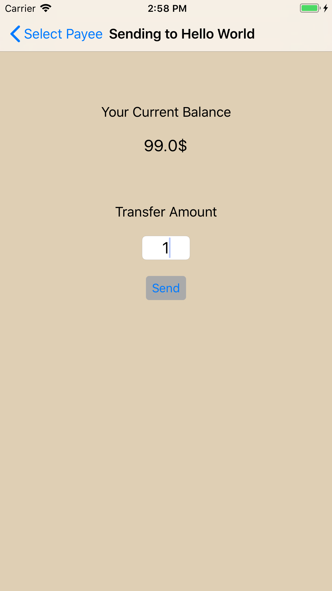

##  Transference

#### Information
    1. Xcode verions :- 9.4.1
    2. Swift version :- 4.1
    3. Minimum iOS support :- iOS10
    4. Current tag v1.0

### Third Party Library
    1. Firebase
        1. To Maintain Login users
        2. To Keep data in server

### How to run (do this in terminal) 
    1. git clone https://github.com/xpd54/Transference
    2. cd Transference
    3. git checkout v1.0
    4. pod update
    5. open Transference.xcworkspace

### Work Flow
    1. App flow start with google signup screen
    2. Login with your google Account
    3. You will get 100.0$ initial balance to play around
    4. You can add payee (only gmail will work for sync)
    5. You will be able to see all the user Of this app as payee, After clicking on trasfer button.
    6. If you signup with two different gmail acount you can see each other as payee try making some trasfer.
    7. All error have been handle silently for now (no pop up).
    8. Three payee are already there (My testing accounts)
    
    PS:- Try Login with two gmail on two different device to see whole flow.

### ScreenShots
  
  
  
  
  
### Known Issue 
    1. Current balance only get updated when app comes into active state

